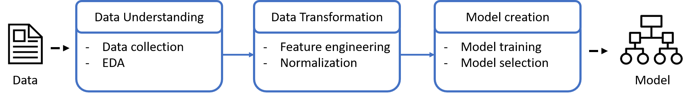
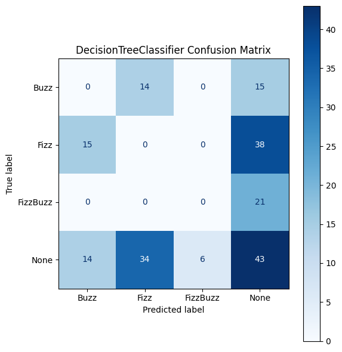
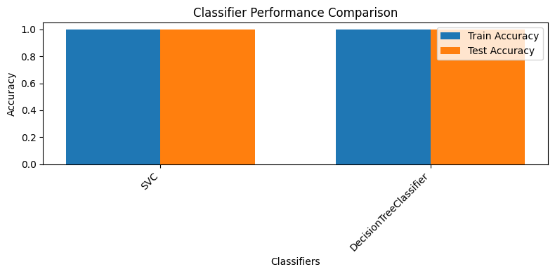
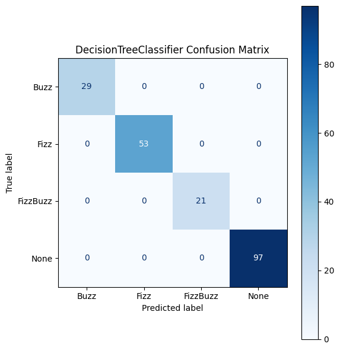

# Machine learning classification
ML FizzBuzz test to build classification models.

## Table of Contents
1. [Project Overview](#project-overview)
2. [Data Description](#data-description)
3. [Data Transformation](#data-transformation)
3. [Classification Models](#classification-models)
4. [Evaluation Metrics](#evaluation-metrics)
5. [Results and Insights](#results-and-insights)
6. [Conclusions](#conclusions)
7. [References](#references)

## 1. Project Overview 
This repository provides a machine learning test to classify natural numbers into four classes: “None”, “Fizz”, “Buzz”, and “FizzBuzz”.

## 2. Data Description 
The dataset was created by generating natural numbers and label them according to an specific criteria. The dataset consists of one file with two columns: one for the number and another one for the label.

## 3. Data Transformation 
In the data transformation, the primary objective is to ready the dataset for modeling, which involves feature engineering to extract features from the natural numbers taking into account class-related attributes. Additionally, normalization techniques can be used when necessary to standardize the data, ensuring it aligns with the requirements of the selected models and facilitating robust classification performance.

## 4. Classification Models 
To address the problem, various classification models were considered, including:
- Support Vector Machine (SVM): SVM is a powerful and versatile machine learning model, capable of performing linear or nonlinear classification, seeking the optimal decision boundary for the separation of distinct classes of data points. The core concept of SVMs involves the establishment of a decision boundary that maximizes the margin—the distance between the nearest data points belonging to distinct classes. Consider a dataset comprising two classes that can be divided by a straight line. In this scenario, the best line (referred to as the decision boundary) is determined by SVMs. This line is not only responsible for class separation but also ensures the maximum distance is maintained from the nearest data points of each class. This approach guarantees robust performance when applied to new data.
- Decision tree (DT): The DT classifier is a versatile machine learning algorithm widely used in classification problems. At its core, it operates by recursively partitioning the feature space into subsets, making decisions at each node based on feature values. This process continues until leaf nodes represent class labels. Decision trees are valued for their interpretability, as they provide clear, human-readable rules for classification. They have the ability to handle both categorical and numerical features, and adapt to complex decision boundaries.

## 5. Evaluation Metrics 
The models were evaluated using accuracy as metric. The best model was selected based on higher accuracy values.

## 6. Results and Insights 
Experiments were conducted using two datasets: the first containing the original data with natural numbers, and the second comprising features generated during data transformation. Both classification models were evaluated and compared on both datasets.
The outcomes from the original dataset suggest that the decision tree classifier outperformed the SVM. However, with the second dataset, both models achieved a perfect accuracy score.
The results strongly imply that the feature set obtained after transformation leads to superior performance.

Results with natural numbers

Results with period-based features

## 7. Conclusions 
The problem in this project focused on classifying natural numbers into four classes: "None," "Fizz," "Buzz," and "FizzBuzz." Two datasets were employed: one with original natural numbers and the other with features generated during data transformation. The results indicated that the DT classifier outperformed the SVM when using the original dataset. However, when utilizing the transformed dataset, both models achieved perfect accuracy scores. This underscores the crucial role of data transformation and feature engineering in enhancing classification performance.

## 8. References 
1. [Géron, A. (2022). Hands-On Machine Learning with Scikit-Learn, Keras, and TensorFlow (3rd ed.). O'Reilly Media, Inc.](https://www.oreilly.com/library/view/hands-on-machine-learning/9781098125967/)

