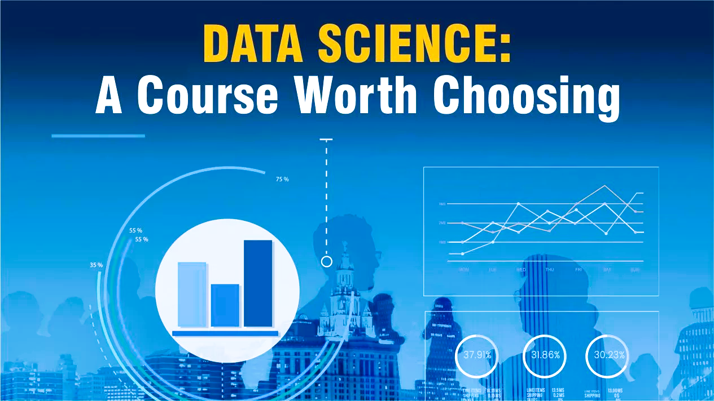

# DataScienceChallenge
 Code challenges that test data science skills.

## Table of Contents
1. [Machine learning classification](#ml-classification)
2. [Machine learning regression](#ml-regression)
3. [Real-World Data Science Challenges](#real-world)

## 1. Machine learning classification 
In this section, several challenges related to the utilization of machine learning for solving classification problems are presented.

1. [ML FizzBuzz](./MLClassification/FizzBuzzREADME.md).

## 2. Machine learning regression 
*This challenge has not been posted yet.*

## 3. Real-World Data Science Challenges 
The following list presents several challenges and issues encountered in real-world data science applications, along with links to repositories containing their solutions:

1. [Electricity Demand Forecasting in the UK](https://github.com/avillalon-dev/Forecasting.ElectricityDemand.UK)